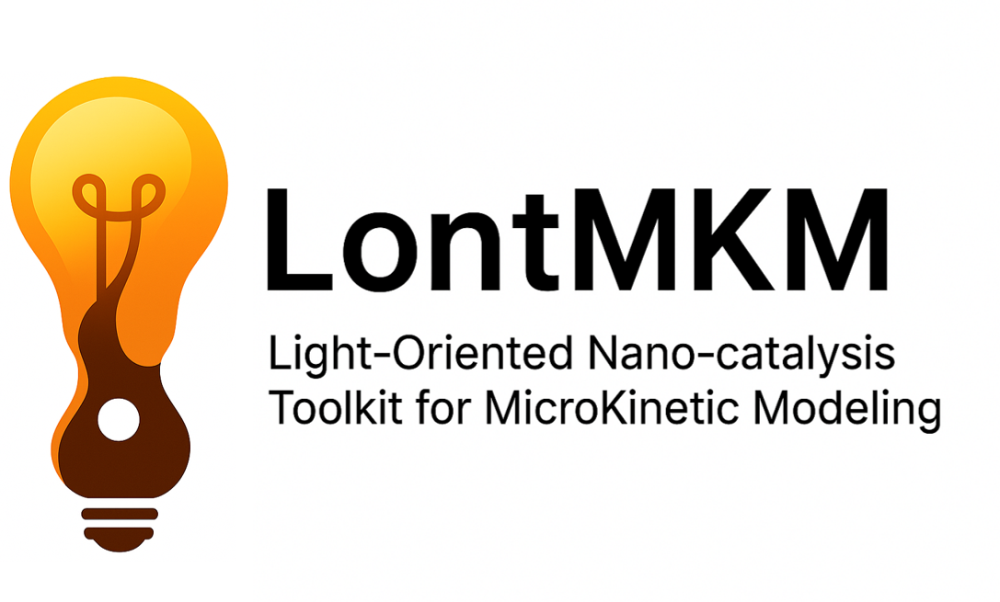

  

# LontMKM

## English
LontMKM (Light-Oriented Nano-catalysis Toolkit for MicroKinetic Modeling) is a Python package for simulating microkinetic reactions involving light-driven catalysis.
It supports rate constant calculations via Marcus theory, Eyring theory, and Transient Absorption Spectroscopy (k = 1/τ).

Features:
- YAML-based input
- Energy units in eV
- Reversible and irreversible reactions
- Automatic stiffness detection for ODE solvers (RK45 or BDF)
- Output as PNG graph and CSV file
- Customizable output names via YAML

Installation:
pip install git+https://github.com/mhputra94/LontMKM.git

Usage example:
1. Create a YAML file, for example example.yaml
2. Run: lontmkm example.yaml
3. Outputs: buaya.png and buaya.csv

---

## Bahasa Indonesia
LontMKM (Light-Oriented Nano-catalysis Toolkit for MicroKinetic Modeling) adalah paket Python untuk mensimulasikan reaksi mikrokinetik yang melibatkan katalis berbasis cahaya.
Mendukung perhitungan konstanta laju dengan teori Marcus, teori Eyring, dan Transient Absorption Spectroscopy (k = 1/τ).

Fitur:
- Input berbasis YAML
- Satuan energi dalam eV
- Reaksi reversibel dan irreversibel
- Deteksi otomatis kekakuan (stiffness) untuk penyelesai ODE (RK45 atau BDF)
- Output dalam bentuk grafik PNG dan file CSV
- Nama file output dapat diatur melalui YAML

Instalasi:
pip install git+https://github.com/mhputra94/LontMKM.git

Penggunaan:
1. Buat file YAML, misalnya example.yaml
2. Jalankan: lontmkm example.yaml
3. Hasil: buaya.png dan buaya.csv

---

## Nederlands
LontMKM (Light-Oriented Nano-catalysis Toolkit for MicroKinetic Modeling) is een Python-pakket voor het simuleren van microkinetische reacties met lichtgestuurde katalyse.
Het ondersteunt de berekening van snelheidsconstanten via Marcus-theorie, Eyring-theorie en Transient Absorption Spectroscopy (k = 1/τ).

Functies:
- YAML-gebaseerde invoer
- Energie-eenheden in eV
- Omkeerbare en onomkeerbare reacties
- Automatische detectie van stijfheid voor ODE-oplossers (RK45 of BDF)
- Uitvoer als PNG-grafiek en CSV-bestand
- Aanpasbare bestandsnamen via YAML

Installatie:
pip install git+https://github.com/mhputra94/LontMKM.git

Gebruik:
1. Maak een YAML-bestand, bijvoorbeeld example.yaml
2. Voer uit: lontmkm example.yaml
3. Uitvoer: buaya.png en buaya.csv

---

## Deutsch
LontMKM (Light-Oriented Nano-catalysis Toolkit for MicroKinetic Modeling) ist ein Python-Paket zur Simulation von mikrokinetischen Reaktionen mit lichtgetriebener Katalyse.
Es unterstützt die Berechnung von Geschwindigkeitskonstanten mittels Marcus-Theorie, Eyring-Theorie und Transient Absorption Spectroscopy (k = 1/τ).

Funktionen:
- YAML-basierte Eingabe
- Energieeinheiten in eV
- Reversible und irreversible Reaktionen
- Automatische Steifigkeitserkennung für ODE-Löser (RK45 oder BDF)
- Ausgabe als PNG-Diagramm und CSV-Datei
- Anpassbare Ausgabedateinamen per YAML

Installation:
pip install git+https://github.com/mhputra94/LontMKM.git

Verwendung:
1. Erstellen Sie eine YAML-Datei, z.B. example.yaml
2. Ausführen: lontmkm example.yaml
3. Ergebnis: buaya.png und buaya.csv

